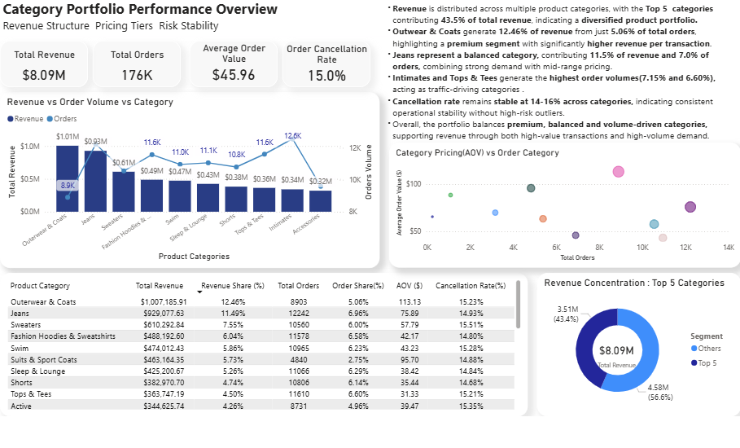
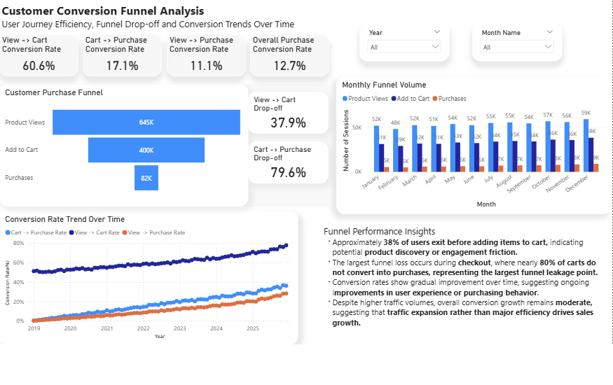
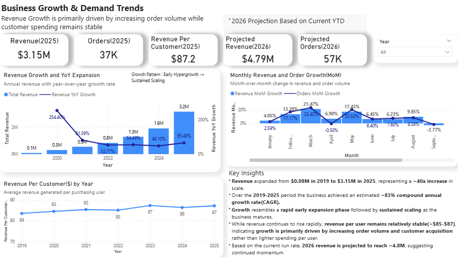

# TheLook Ecommerce Analytics

End-to-end ecommerce analytics project built using **Bigquery, SQL, and PowerBI** based on the public **TheLook Ecommerce dataset**.

The project simulates a real-world analytics workflow - building a structured data model, creating analytical SQL layers, and delivering business insights through an executive dashboard.

---

# Project Objective

Analyze ecommerce performance across three key business dimensions.

- **Product Portfolio Performance**
- **Customer Conversion Funnel Efficiency**
- **Business Growth & Demand Trends**
The goal is to understand **what drives revenue growth, where customers drop off in the funnel, and which product categories contribute most to performance.**

---

# Tech Stack

**Data Warehouse**

- Google Bigquery
- SQL(Data Modeling + Aggregations)

**Visualization**  

- PowerBI

 **Analytics Techniques**
 
 - KPI Modeling
 - Conversion Funnel Analysis
 - Revenue Decomposition
 - Growth Analysis (MoM / YoY / CAGR)

---

# Dashboard Overview

## 1. Category Portfolio Performance 

Analyzes how different product categories contribute to revenue and order volume.

Key metrics include:
- Total Revenue
- Total Orders
- Average Order Value (AOV)
- Cancellation Rate
- Revenue Share by Category

Insights help identify:

- Premium categories driving revenue
- Volume-driven categories generating traffic
- Portfolio diversification across product group

---

## 2. Customer Conversion Funnel

Tracks the user journey through the ecommerce funnel:

**Product View -> Add to Cart -> Purchase**

Key metrics:

- View -> Cart Conversion Rate
- Cart -> Purchase Conversion Rate
- Overall Purchase Conversion Rate
- Funnel Drop-off Analysis

The dashboard also shows **conversion trends over time**, revealing improvements in user purchasing behavior.

---

## 3. Business Growth & Demand Trends

Examines long-term scaling of the business.

Key metrics include:

- Revenue Growth
- Order Volume Growth
- Revenue per Customer
- Month-over-Month Growth
- Year-over-Year Growth
- Growth Pattern Analysis

The dashboard highlights how the business scaled from early growth to sustained expansion.

---

# Key Insights

- Revenue expanded from **$0.08M in 2019 to $3.15M in 2025** (~40x growth).
- The business achieved approximately **~83% Compound Annual Growth Rate(CAGR)**.
- Growth follows a **T2D3-style scaling pattern**, with rapid early expansion followed by more stable growth.
- **Revenue per customer remains relatively stable**, indicating that growth is driven primarily by **customer acquisition and order volume expansion rather than increasing spend per user**.

---

# Data Pipeline

The analytical layer was built in **Bigquery using SQL**.

Main steps:

1. Build cleaned **fact tables** for order transactions.
2. Create **dimension tables** for product metadata.
3. Aggregate **monthly and yearly KPI tables**.
4. Generate **category performance and funnel metrics**.
5. Connect the analytical layer to **PowerBI dashboards**.

---

# Repository Structure

# Dataset

Google Bigquery Public Dataset

bigquery-public-data.thelook_ecommerce

 Dataset includes:
 
 - Orders
 - products
 - Events
 - Users

---

# Author

Domnic Sunny
